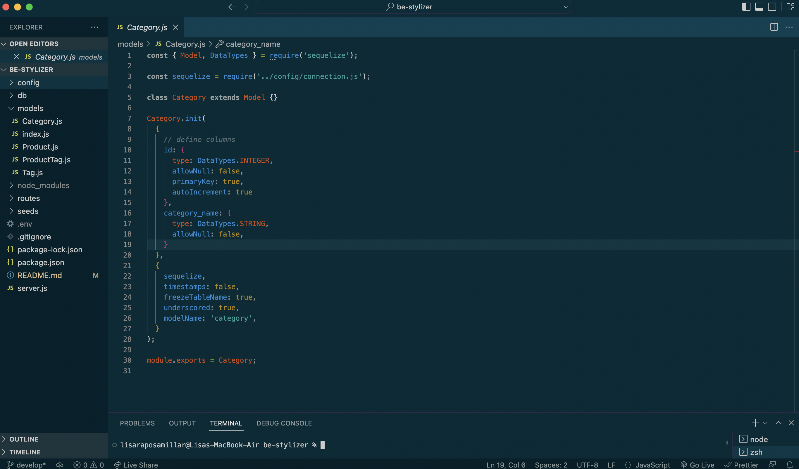
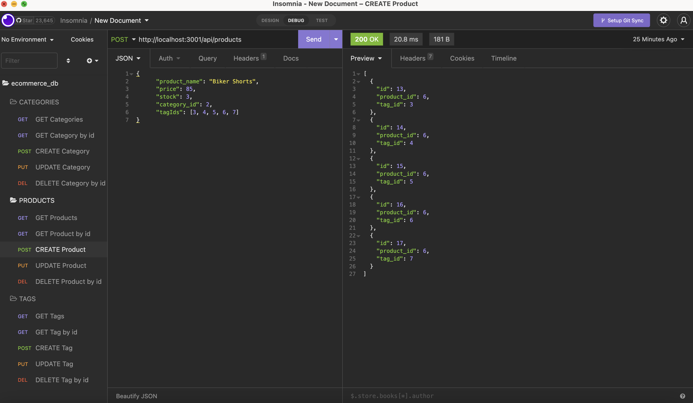

# BE Stylizer

  ###  

  ## Table of Contents
  - [Description](#description)
  - [Installation](#installation)
  - [Usage](#usage)
  - [Contributing](#contributing)
  - [Tests](#tests)
  - [Questions](#questions)
  - [License](#license)

  ## Description 
  The BE, or back-end, Stylizer is a sample ecommerce database.  It has been configured to store and report merchandise category, product, and tag information. <a href="https://drive.google.com/file/d/1mgnaxaFY9X0sMMub18PdLh92GBDzOp1C/view?usp=sharing">Walkthrough Video Link</a>  
  N.B.: Bootcamp study project
  
  ## Installation 
   1. Node.js (npm init) 2. npm i express@4.18.1 3. npm i mysql2@2.3.3 4. npm i sequelize@6.23.1 5. npm i dotenv@16.0.2 6. npm i nodemon@2.0.20
  
  ## Usage
   1. Create the schema in MySQL shell: source db/schema.sql 2. Seed the database from the CLI: npm run seeds 3. Start the server: npm start

  ## Contributing 
  Developers who have ideas for improvement may fork this project and submit pull requests for review.

  ## Tests
  Testing for this application was completed by running api routes in Insomnia.  See <a href="https://drive.google.com/file/d/1mgnaxaFY9X0sMMub18PdLh92GBDzOp1C/view?usp=sharing">walkthrough video</a> for details.

  ## Questions 
  Please feel free to reach out via either of the links below if you have additional questions about this application. 
  GitHub: <a href="https://github.com/raposamillar/">raposamillar</a> 
  Email: lisa.raposamillar@gmail.com

  ## License
  ### This application is covered under the [GPL v3.0](https://choosealicense.com/licenses/gpl-3.0/) license.
  
 

